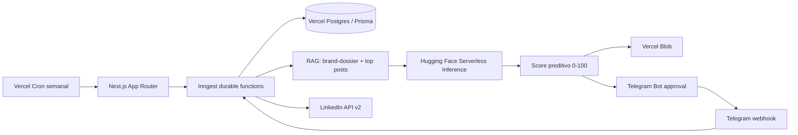

# Autonomous LinkedIn Content Engine (100% Zero-Cost Stack)

Pipeline serverless em TypeScript para gerar, pontuar, renderizar, aprovar e publicar conteúdo no LinkedIn. O projeto combina Next.js App Router, Prisma/Postgres, Inngest, Hugging Face Serverless Inference, Vercel Blob, Telegram e LinkedIn REST API.

## Arquitetura



## Stack

- Next.js 15 com App Router e TypeScript estrito
- Prisma ORM e Vercel Postgres
- Inngest para steps, retries, agendamento e reposição de estoque
- Hugging Face Serverless Inference API nativa, usando `Qwen/Qwen2.5-Coder-32B-Instruct` e `black-forest-labs/FLUX.1-schnell`
- `@vercel/og`, `pdf-lib` e Vercel Blob para criativos
- Telegram Bot API para aprovação
- LinkedIn REST API v2 para publicação
- RAG em Prisma e score heurístico explicável em TypeScript

## Como executar

1. Clone o repositório e instale as dependências:

   ```bash
   npm install
   ```

2. Copie `.env.example` para `.env.local` e preencha as credenciais. Nunca versione `.env` ou `.env.local`.

3. Sincronize o banco:

   ```bash
   npm run prisma:push
   ```

4. Em um terminal, execute o Next.js e o Inngest Dev Server:

   ```bash
   npm run dev
   npx inngest-cli@latest dev -u http://localhost:3000/api/inngest
   ```

5. Gere um lote local:

   ```bash
   npm run generate:draft
   ```

6. Registre o webhook Telegram na implantação oficial:

   ```bash
   npm run telegram:set-webhook
   ```

## Operações úteis

```bash
npm run typecheck
npm run build
npm run queue:reset       # remove somente estados descartáveis
```

O reset da fila é deliberadamente restrito a estados descartáveis; posts aprovados, agendados e publicados não são removidos. Não existe um comando público para apagar a fila inteira.

## Fluxo de aprovação

O Telegram recebe a projeção `🔮 Projeção de Engajamento: [Nota]/100 ([Classificação])` e botões inline. O webhook responde `answerCallbackQuery` imediatamente, faz a transição idempotente no Prisma e envia `posts/publish.requested` ao Inngest. A publicação respeita `scheduledFor`.

## Licença e segurança

Este repositório é um case de portfólio. Revise permissões e termos das APIs antes de publicar em produção. Segredos devem existir somente no ambiente local ou nos Environment Variables da Vercel.
